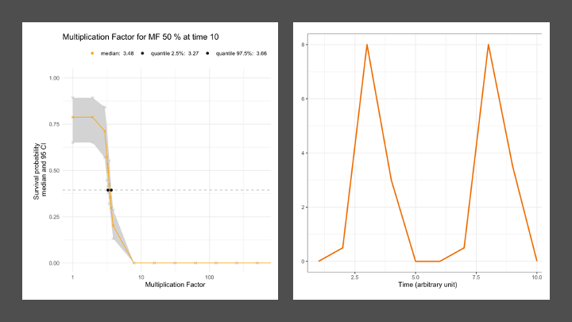

# Summary
Package `morse` is devoted to the analysis of experimental data collected from standard toxicity tests. It provides ready-to-use functions to visualize a data set and to estimate several toxicity indices to be further used in support of environmental risk assessment in full compliance with regulatory requirements. Such toxicity indices are indeed classical requested by standardized regulatory guidelines on which national agencies base their evaluation of applications for marketing authorisation of chemical active substances.

Package `morse` can be used to get estimates of $LC_x$ ($x$\% Lethal Concentration) or $EC_x$ ($x$\% Effective Concentration) by fitting standard exposure-response models on toxicity test data. Risk indicator estimates as well as model parameters are provided along with the quantification of their uncertainty. Package `morse` can also be used to get estimates of the $NEC$ (No Effect Concentration) by fitting a Toxicokinetic-Toxicodynamic (TKTD) model (namely `GUTS` models, that is *General Unified Threshold models of Survival*). Using `GUTS` models also allow to get estimates of $LC_{(x,t)}$ (whatever $x$ and $t$) and $LP_{(x,t)}$, this later being defined by EFSA as the $x$\% multiplication factor leading to an additional reduction of $x$\% in survival at the end of the exposure profile. Above all, `GUTS` models can be used on data collected under time-variable exposure profiles.

This paper illustrates a typical use of `morse` with survival data collected over time and at different increasing exposure concentrations, analysed with the reduced version of GUTS models based on the stochastic death hypothesis (namely, the `GUTS-RED-SD` model). This example can be followed step-by-step to analyse any new data set, as long as the data set format is respected.

# Statement of Need
Package `morse` [@morse2021] has been tested using `R` (version 3.5 and later) on macOS, Linux and Windows machines. Regarding the particular case of toxicokinetic-toxicodynamic (TKTD) models for survival, namely GUTS models [@Jager2018], package `morse` was ring-tested together with nine other `GUTS` implementations under different software platforms. All participants to the ring-test received the same data sets and tasks, carried out their simulations independently from each other and sent the results back to the coordinator for analysis. Giving very similar results than the other implementations, package `morse` was thus confirmed as fit-for-purpose in fitting GUTS models on survival toxicity test data.

All functions in package `morse` can be used without a deep knowledge of their underlying probabilistic model or inference methods. Rather, they were designed to behave as well as possible, without requiring the user to provide values for some obscure parameters. Nevertheless, models implemented in `morse` can also be used as a first step to tailor new models for more specific situations.

Note that package `morse` benefits from a web interface, MOSAIC, from which the same analyses can be reproduced directly on-line without needs to invest in `R` programming. MOSAIC is freely available at [https://mosaic.univ-lyon1.fr/](https://mosaic.univ-lyon1.fr/) [@Charles2017] (Figure \ref{fig:mosaic}).


# Availability 
Package `morse` is available as an `R` package; it can be directly downloaded from CRAN [https://CRAN.R-project.org/package=morse](https://CRAN.R-project.org/package=morse), where package dependencies and system requirements are also documented. The development version can be found on GitHub [https://github.com/pveber/morse](https://github.com/pveber/morse), where code contributions, bug reports, fixes and feature requests are more than welcome by opening issues and pull requests.

# Main features
The main functions in package `morse` are `survData()`, `reproData()` and `plotDoseResponse()` to visualize raw data. Functions `survFitTT()`, `reproFitTT()`, `survFit()` allow to fit a model on data in order to estimate toxicity indicators, the choice depending on the type of data. Fitting outputs can be either displayed with `plot()` or synthesized with `summary()`. Functions are available to check the goodness-of-fit, namely `ppc()` and `plot_prior_post()`. Predictions can be performed with `predict()`, `predict_ode()`, `predict_Nsurv()` and `predict_Nsurv_ode()`. At last, function `LCx()`and `MFx()` allow to get $x$\% lethal concentrations or profiles, respectively.

The `morse` package currently handles binary and count data, as for example survival and reproduction data. Functions dedicated to binary (resp. count) data analysis start with a `surv` (resp. `repro`) prefix. `morse` provides a similar workflow in both cases:

1. create and validate a data set;
2. explore a data set;
3. plot a data set;
4. fit a model on data and get parameter estimates;
5. check goodness-of-fit with Posterior Predictive Check plot (PPC).

In addition, for binary data handled with `GUTS` models, package `morse` also allows to:

1. calculate and plot $LC_{(x,t)}$ and $LP_{(x,t)}$;
2. compute goodness-of-fit criteria: the PPC percentage, the Normalized Root Mean Square Error (NRMSE) and the Survival probability prediction error at the end of the exposure profile (SPPE).

See [@EFSA2018] for details.

Those steps are presented in depth in the `Tutorial` available at  [https://cran.r-project.org/web/packages/morse/vignettes/tutorial.html](https://cran.r-project.org/web/packages/morse/vignettes/tutorial.html), with all necessary details to plenty use all `morse` features. A more formal description of the models and the estimation procedures are provided in a document called "Models in morse package" available at [ https://cran.r-project.org/web/packages/morse/vignettes/modelling.pdf]( https://cran.r-project.org/web/packages/morse/vignettes/modelling.pdf). Please refer to this documentation for further introduction to the use of the `morse` package.

# Minimal Working Example

## Loading `morse` and its dependencies
In order to use package `morse`, you need to install it with all its dependencies, including JAGS and C++ (see below), as well as other R-packages: mandatory ones (`coda`, `deSolve`, `dplyr`, `epitools`, `graphics`, `grDevices`, `ggplot2` ($\geqslant$ 2.1.0), `grid`, `gridExtra`, `magrittr`, `methods`, `reshape2`, `rjags` ($\geqslant$ 4.0), `stats`, `tibble`, `tidyr`, `zoo`) and suggested ones (`knitr`, `rmarkdown`, `testthat`). For this purpose, you can use the two classical `R` commands:

```r
### install the `morse` package, if needed
if(is.element('morse', installed.packages()[,1]) == FALSE){
  install.packages('morse')
}
### load the `morse` package
library(morse)
```

### JAGS
The `morse` package is linked to JAGS [http://mcmc-jags.sourceforge.net/](http://mcmc-jags.sourceforge.net/) that is the Bayesian sampler used to perform inference with all implemented models. So, you need also to download and install JAGS at [https://sourceforge.net/projects/mcmc-jags/](https://sourceforge.net/projects/mcmc-jags/). Then you must test that your `R` graphical user interface has access to JAGS, and, if not, to specify where JAGS can be found on your computer. Indeed, once installed, JAGS can be lost in the PATH. To help solving this issue, you can use package `runjags` which is not within `morse` so that you have to install and load it too.

```r
### install the `runjags` package, if needed
if(is.element('runjags', installed.packages()[,1]) == FALSE){
  install.packages('runjags')
}
### load the `runjags` package
library("runjags")
### run test
testjags()
```

The output should look like this:

```
You are using R version 4.0.2 (2020-06-22) on a windows machine, with the RStudio GUI
JAGS version 4.3.0 found successfully using the command
'C:/Program Files/JAGS/JAGS-4.3.0/x64/bin/jags-terminal.exe'
The rjags package is installed
```

Otherwise, you can specify to your `R` graphical user interface where JAGS executable is located in your computer (somewhere in `'C:/Program Files/JAGS/JAGS-4.3.0/x64/bin/jags-terminal.exe'` on Windows machines):

```r
testjags(jags=runjags.getOption('jagspath'))
### replace `jagspath` by your own PATH to JAGS
### For instance
### 'C:/Program Files/JAGS/JAGS-4.3.0/x64/bin/jags-terminal.exe'
```

### C++
The `morse` package is also linked to C++. C++ is used for running simulations leading to predictions. In `R`, you should not have issues with C++ requirements since it is very well integrated (many `R` functions are simple interfaces to C++ functions). Feel free to report any trouble at [https://github.com/pveber/morse/issues](https://github.com/pveber/morse/issues) by opening a new issue for the `morse` package.

## Survival analysis
We assume hereafter that `morse` and all the above dependencies have been corrected installed. To illustrate the use of `morse`, we will use a standard survival data set coming from a chronic laboratory toxicity test with *Gammarus pulex*, a freshwater invertebrate, exposed to increasing concentrations of propiconazole (a fungicide) during four days. Eight concentrations were tested with two replicates of 10 organisms per concentration. Survival was monitored at five time points (at day 0, 1, 2, 3 and 4) [@Nyman2012].

We will used the reduced version of the GUTS model based on the stochastic death hypothesis (namely, the `GUTS-RED-SD` model), as recommended by the *European Food Safety Authority* (EFSA) for the environmental risk assessment (ERA) of plant protection products potentially toxic for aquatic living organisms [@EFSA2018]. This model can also be fitted on-line with the MOSAIC web platform [@Baudrot2018b]. Below is the *modus operandi* with package `morse` to be followed step-by-step in order to be in full compliance with the EFSA workflow for ERA.

### Calibration step

```r
### load package `morse`
library(morse)
### load a data set
data("propiconazole")
### create a morse object for binary data analysis
survData_PRZ <- survData(propiconazole)
### fit a reduced GUTS model (GUTS-RED) with option "SD" (Stochastic Death)
fit_cstSD <- survFit(survData_PRZ, model_type = "SD")
### plot the fitting result
plot(fit_cstSD)
```


### Get the $x$\% lethal concentration
Using a GUTS model with `morse` allows to get a probability distribution on the $x$\% lethal concentration whatever the exposure duration $t$, namely the $LC_{(x,t)}$. By default, $t$ corresponds to the last time point in the data set and $x = 50$\%.

```r
### run function LCx()
LCX_cstSD <- LCx(fit_cstSD)
### plot the output as a concentration-response curve
plot(LCX_cstSD)
```


### Validation step
Validation consists in predicting the number of survivors over time under pulsed-exposure profiles for which observations have also been collected. Predictions are then compared to observations and their adequacy is checked according to several validation criteria defined by EFSA [@EFSA2018]. The aim of this step is to choose an appropriate model for the following step.

```r
### load data collected under pulsed exposure profiles
data("propiconazole_pulse_exposure")
### predict the number of survivors for all profiles
predict_Nsurv <- predict_Nsurv_ode(
  object = fit_cstSD,
  data_predict = propiconazole_pulse_exposure
)
### plot results
plot(predict_Nsurv)
```

```r
predict_Nsurv_check(predict_Nsurv)
```


Once the predictions are visually checked (Figure \ref{fig:nsurv}), quantitative validation criteria need to be calculated.

```r
### check for adequacy between predictions and observations
predict_Nsurv_check(predict_Nsurv)
```

```r
check <- predict_Nsurv_check(predict_Nsurv)
check$Percent_PPC_global
check$Percent_NRMSE_global
```

This reveals that, in total, 84\% of the observations lie within the uncertainty band of the predictions, while the global variability of data around the predictions is 16.2\%. For both criteria, a maximum value of 50\% is expected, what means here that we do not expect specific risk for the species and the chemical compound under consideration.

### Prediction step
Risk assessors are interested in testing various exposure scenarios, having a certain environmental realism that is varying over time. Risk assessors expect to evaluate the potential impact of these profiles on survival of target species to protect. Typically, they want to compute the multiplication factor $MF_{(x,t)}$ that could be applied to the exposure profile without reducing more than by $x$\% the survival probability at a specified test duration $t$ (default being the last time point of the exposure profile). This is the so-called $x$\% lethal profile, denoted $LP_x$, and newly proposed by [@EFSA2018]. This calculation is provided by function `MFx()` in `morse`.

The mathematical definition of the $x$\% Multiplication Factor at time $t$ (at the end of a time series $T = \{0, …, t\}$) is given by:

$$S\left(MF_{(x,t)} \times C_w(\tau \in T), t\right) = S( C_w(\tau \in T), t) \times \left(1-\frac{x}{100}\right)$$

where $C_w(\tau \in T)$ is the original exposure profile, and expression $S\left(MF_{(x,t)} \times C_w(\tau \in T), t\right)$ the survival probability after the exposure profile has been translated upward by a multiplication $MF_{(x,t)}$; the new exposure profile thus becomes equal to $MF_{(x,t)} \times C_w(\tau \in T)$.

```r
### define an exposure profile (here a theoretical one)
data_4MFx <- data.frame(time = 1:10,
                        conc = c(0,0.5,8,3,0,0,0.5,8,3.5,0))
### run function MFx()
MFx_PRZ_cstSD <- MFx(object = fit_cstSD, data_predict = data_4MFx, ode = TRUE)
### plot the survival probability at the end of the exposure profile
### according to a range of multiplication factors (log-scale)
plot(MFx_PRZ_cstSD, log_scale = TRUE)
```



### Predict survival probability under any exposure profile
Finally, it may be useful to predict the survival probability under any exposure profile (time-variable or not), for example when designing new experiments or to better understand what happens in field. Below are some examples from which you can inspire to perform your own simulations.

```r
### define an exposure profile (here a theoretical one)
### note that here you need to specify a third column `replicate`
data_example <- data.frame(
   time = c(1,1.9,2,15,15.1,20),
   conc = c(0,0,20,20,0,0),
   replicate = rep("Basic example", 6)
)
### perform basic prediction
predict_example_NULL <- predict_ode(
  object = fit_cstSD,
  data_predict = data_example,
  mcmc_size = 10,
  interpolate_length = NULL)
### plot the result for only few exposure time points
plot(predict_example_NULL)
### define the same basic exposure profile
### but by changing the `replicate` value
data_example <- data.frame(
   time = c(1,1.9,2,15,15.1,20),
   conc = c(0,0,20,20,0,0),
   replicate = rep("Basic example (interpolation)", 6)
)
##### perform prediction with interpolation of the exposure profile
predict_example_100 <- predict_ode(
  object = fit_cstSD,
  data_predict = data_example,
  mcmc_size = 10,
  interpolate_length = 100)
# plot the result
plot(predict_example_100)
### load an environmentally realistic profile
data("FOCUSprofile")
FOCUSprofile[,"replicate"] <- "FOCUS example"
### perform prediction
predict_FOCUS <- predict_ode(
  object = fit_cstSD,
  data_predict = FOCUSprofile,
  mcmc_size = 10,
  interpolate_length = NULL)
### plot the result
plot(predict_FOCUS)
```


# Research using `morse`
Package `morse` was recently used to evaluate the added-value of using TKTD models in comparison with classical dose-response models, based on a case study with the snail *Limnaea stagnalis* when exposed to increasing concentrations of cadmium [@baudrot2018a]. Also based on `morse`, we proposed some recommendations to address TKTD assessment using uncertainties in environmental risk models [@Baudrot2019].

# Data availability
A collection of eight data sets is made available directly in package `morse` (use function `data()`). These data sets can also be downloaded on-line from the MOSAIC web platform by visiting the different modules: [https://mosaic.univ-lyon1.fr](https://mosaic.univ-lyon1.fr).

# Author contributions
V.B. (main developer of `morse`): conceptualization, methodology, formal analysis, data curation, visualization, writing manuscript. S.C.: supervision, funding acquisition, project administration, formal analysis, data curation, writing manuscript.

# Acknowledgments
Authors fully thank all contributors to the `morse` package: Marie Laure Delignette-Muller, Wandrille Duchemin, Benoît Goussen, Nils Kehrein, Guillaume Kon-Kam-King, Christelle Lopes, Philippe Ruiz, Alexander Singer and Philippe Veber. They also thank the French National Agency for Water and Aquatic Environments (ONEMA, now the French Agency for Biodiversity) for its financial support to the development of the `morse` package.

# References

